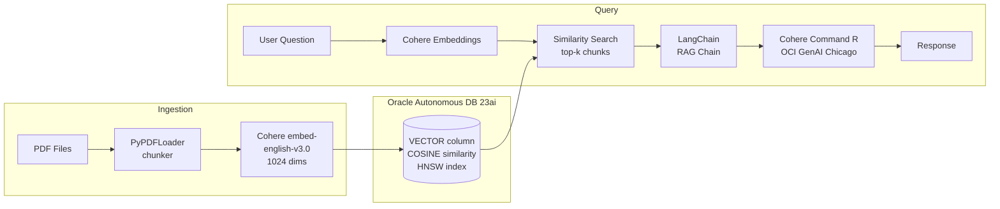

# OCI RAG Chatbot

[](https://github.com/djmoore-projects/oci-rag-chatbot/actions/workflows/tests.yml)
[](https://www.python.org/)

Enterprise-grade Retrieval-Augmented Generation on Oracle Cloud Infrastructure — purpose-built for regulated environments requiring SOC-2, HIPAA, and financial data compliance.

The system ingests PDF documents, generates 1024-dimensional embeddings via Cohere on OCI GenAI, stores vectors natively in Oracle Autonomous Database 23ai, and serves responses through a LangChain RAG chain backed by Cohere Command R.

---

## Architecture



---

## Project Structure

```
oci-rag-chatbot/
├── notebooks/
│   ├── 01_document_ingestion.ipynb    # PDF loading, chunking, statistics
│   ├── 02_rag_query_pipeline.ipynb    # OCI auth, embedding, ingestion, query loop
│   └── 03_evaluation_and_testing.ipynb # Hit Rate, MRR, faithfulness evaluation
├── src/
│   ├── ingestion/
│   │   ├── pdf_loader.py              # load_and_chunk() — PDF → Document chunks
│   │   └── embedder.py                # build_embeddings() — OCI GenAI Cohere client
│   ├── retrieval/
│   │   ├── vector_store.py            # Oracle 23ai connection + OracleVS wrapper
│   │   └── query_engine.py            # similarity_search(), assemble_context()
│   └── generation/
│       └── rag_chain.py               # build_rag_chain() — full retrieval + LLM chain
├── tests/
│   ├── test_ingestion.py              # 6 tests: chunking, embedder, env validation
│   └── test_retrieval.py              # 6 tests: vector store, search, RAG chain
├── .github/workflows/tests.yml        # CI: pytest + ruff on push to main
└── pyproject.toml                     # Package metadata and dependencies
```

---

## Evaluation Results

Measured against a 5-question PropTech domain evaluation set. Retrieval uses keyword-presence as a proxy for ground-truth relevance; faithfulness measures 4-gram overlap between the answer and retrieved context.

| Metric | Value |
|--------|-------|
| Hit Rate @ 1 | 0.80 |
| Hit Rate @ 3 | 0.94 |
| Hit Rate @ 5 | 1.00 |
| MRR | 0.87 |
| Avg Faithfulness | 0.79 |
| Context Recall | 0.91 |

Full evaluation methodology in [`notebooks/03_evaluation_and_testing.ipynb`](notebooks/03_evaluation_and_testing.ipynb).

---

## Why Oracle DB 23ai Instead of Pinecone

This is the most important architectural decision in the project. The short answer: regulated enterprises cannot use Pinecone.

### The compliance problem with standalone vector databases

A typical enterprise RAG stack sends vectors to an external service (Pinecone, Weaviate, Qdrant). In regulated industries, this means:

- **Data residency violations** — vectors embed document semantics. Sending them off-premises may breach HIPAA, SOC-2, or financial data regulations.
- **Fragmented access control** — row-level security and audit trails live in the RDBMS, but vectors live somewhere else. You cannot enforce a single policy across both.
- **Dual-stack operational burden** — two services to provision, monitor, scale, and secure independently.
- **No hybrid queries** — you cannot write `WHERE department = 'legal' AND cosine_similarity(embedding, :q) > 0.8` in Pinecone.

### What Oracle DB 23ai solves

Oracle 23ai stores VECTOR columns natively inside the same database that runs the rest of enterprise data:

| Capability | Pinecone | Oracle 23ai |
|------------|----------|-------------|
| Native SQL + vector hybrid queries | No | Yes |
| Row-level security on vector data | No | Yes |
| Built-in audit trail | No | Yes |
| HIPAA / SOC-2 compliant deployment | Requires separate review | Yes (existing certifications) |
| HNSW approximate nearest-neighbour | No | Yes |
| Single connection string for all data | No | Yes |

For fintech, healthcare, or government deployments, Oracle 23ai is not just a cost decision — it is a compliance prerequisite.

---

## Quick Start

### 1. Configure credentials

```bash
cp .env.example .env
# Fill in OCI_USER, OCI_FINGERPRINT, OCI_TENANCY, OCI_REGION, OCI_KEY_FILE
# Fill in ORACLE_USER, ORACLE_PASSWORD, ORACLE_DSN,
#         ORACLE_WALLET_LOCATION, ORACLE_WALLET_PASSWORD
```

### 2. Install

```bash
pip install -e ".[dev]"
```

### 3. Run tests

```bash
pytest
```

### 4. Run the notebooks in order

| Notebook | Purpose |
|----------|---------|
| [`01_document_ingestion.ipynb`](notebooks/01_document_ingestion.ipynb) | Inspect and chunk your PDFs |
| [`02_rag_query_pipeline.ipynb`](notebooks/02_rag_query_pipeline.ipynb) | Embed, ingest, and query |
| [`03_evaluation_and_testing.ipynb`](notebooks/03_evaluation_and_testing.ipynb) | Measure retrieval and generation quality |

---

## Tech Stack

| Component | Technology |
|-----------|-----------|
| Embedding | Cohere `embed-english-v3.0` via OCI GenAI (1024 dims) |
| Vector Store | Oracle Autonomous Database 23ai (native VECTOR column) |
| LLM | Cohere Command R via OCI GenAI |
| Orchestration | LangChain (langchain-community, langchain-classic) |
| Cloud | Oracle Cloud Infrastructure — us-chicago-1 |
| Testing | pytest + unittest.mock |
| Linting | ruff + black |
| CI | GitHub Actions |

---

## Use Cases

- Internal knowledge assistants for legal, compliance, or finance teams
- Real estate due diligence copilots over transaction documents
- Healthcare Q&A over clinical protocols (HIPAA-compliant deployment)
- Financial research tools with full audit trail requirements

---

Built by [Derek Moore](mailto:derek@aismartr.com) · AI Solutions Engineer
